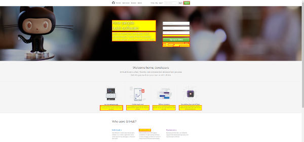

# a11y-ci

Continuous accessibility testing, with HTML and JUnit, reports

## Installation

    npm install -g a11y-ci

## Usage

    a11y-ci [--junit=junit.xml] [--html=report.html] [--violations=pmd.xml] <url>
    
    # Example:
    a11y-ci --html=report.html https://www.github.com 

Options:

+ `--html=myfile.html`: generates a HTML report file
+ `--junit=myfile.xml`: generates a JUnit report file
+ `--violations=myfile.xml`: generates a Pmd (violations) report file

## How it works

a11y-ci browses websites with [PhantomJs](https://github.com/ariya/phantomjs) and audit accessibility with the 
[Accessibility Developer Tools](https://github.com/GoogleChrome/accessibility-developer-tools). 

You can refer to the [Audit rules](https://github.com/GoogleChrome/accessibility-developer-tools/wiki/Audit-Rules)

## Licence

Copyright Radio France, Licence [CeCILL-B](http://www.cecill.info/licences/Licence_CeCILL-B_V1-en.html) (fully compatible with BSD-like licenses (BSD, X11, MIT))